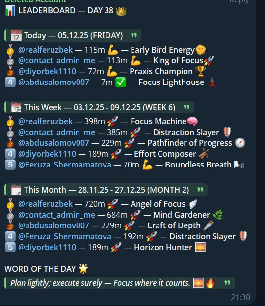

# Studywithferuzbek Tracker — Telegram Study Leaderboards (Day / Week / Month)

A **Python + Telethon** tracker that monitors a Telegram group’s active voice/video call participation and produces **daily / weekly / monthly leaderboards**, with:
- automatic daily posting at a fixed time,
- a manual “post now” trigger,
- optional export to a web dashboard ingest endpoint,
- and Windows-friendly secret storage (DPAPI) for local operation.

> This repo also includes a **minimal Next.js API** endpoint (`/api/admin/state`) protected by a shared secret (optional utility).

---

## Screenshots (real usage)

<table>
  <tr>
    <td width="50%" align="center">
      
      <br />
      <sub><b>Automated Telegram leaderboard post (day / week / month)</b></sub>
    </td>
    <td width="50%" align="center">
      
      <br />
      <sub><b>Live study session environment (members + focus workflow)</b></sub>
    </td>
  </tr>
</table>

---

## What problem this solves

In study communities, consistency is hard to maintain because “effort” is not visible.  
This tracker turns participation into a measurable signal:
- consistent leaderboard snapshots,
- predictable daily posting,
- and (optionally) a pipeline into a web dashboard for history/visualization.

---

## Core features (code-backed)

### 1) Daily auto-posting (Asia/Tashkent)
- Scheduled daily leaderboard post at **21:30 Asia/Tashkent**
- Startup backfill logic: posts any missed days and can post “today” immediately if the service starts after 21:30

### 2) Manual “post now” trigger
- Running `python post_now.py` creates a flag file:
  - `post_now.flag`
- The tracker detects it and posts without breaking the daily schedule

### 3) Minimum session-time gate (anti-noise)
- Participation segments shorter than **300 seconds (5 minutes)** are ignored for leaderboard calculations

### 4) Leaderboards (day / week / month)
- Generates separate leaderboards for:
  - **today**
  - **current week**
  - **current month**
- Formats output for Telegram posting

### 5) Posting transport options
- Can post via:
  - a **user session** (Telethon session / StringSession), or
  - a **Telegram bot** (if bot env vars are provided)

### 6) Local persistence (SQLite + state JSON)
- SQLite database stored at:
  - `var/study.db`
- Operational state file:
  - `tracker_state.json`
- Logs written under:
  - `var/`

### 7) Optional: export to a web dashboard ingest endpoint
- When enabled, exports the latest snapshot to:
  - `LEADERBOARD_INGEST_URL`
- Uses shared secret header:
  - `LEADERBOARD_INGEST_SECRET`
- Toggle:
  - `LEADERBOARD_WEB_EXPORT_ENABLED=true`

### 8) Separation guard (web integration stays isolated)
- `scripts/verify-separation.py` enforces that website-integration references stay inside `web_export.py`

### 9) Windows DPAPI secret storage (optional)
- `secure_env.py` + `scripts/secure_env_tool.py` provide a **DPAPI-backed** store for secrets (Windows)
- Designed so plaintext secrets don’t need to live on disk

---

## High-level architecture

1) Tracker connects to Telegram using Telethon  
2) Call-related updates trigger roster refresh + participation accounting  
3) Participation is accumulated per user, with alias grouping support  
4) Leaderboards are generated for day/week/month  
5) Output is posted to Telegram (user session or bot)  
6) Optional: snapshot is exported to a web ingest endpoint

---

## Repo layout (important files)

### Python (tracker + tools)
- `study_tracker.py` — main tracker (scheduler, tracking, leaderboards, posting)
- `post_now.py` — manual post trigger (creates `post_now.flag`)
- `web_export.py` — optional export to dashboard ingest endpoint
- `env_loader.py` — environment loading (includes DPAPI store integration)
- `tg_session_qr.py` — StringSession generator (prints session string)
- `login.py` — login/session sanity check
- `scripts/secure_env_tool.py` — DPAPI secret manager (Windows)
- `scripts/verify-separation.py` — separation guard

### Next.js (optional utility)
- `app/api/admin/state/route.ts` — protected endpoint returning `session_version`
  - Auth via `x-cron-secret: <CRON_SECRET>` or `Authorization: Bearer <CRON_SECRET>`
- `middleware.ts` — request gating for the Next.js app
- `package.json` — Next.js scripts (`dev`, `build`, `start`, `lint`)

---

## Run locally (Tracker)

### 1) Create venv
```bash
python -m venv .venv
```

### 2) Install dependencies
```bash
# Windows
.venv\Scripts\pip install -r requirements.txt

# macOS/Linux
.venv/bin/pip install -r requirements.txt
```

### 3) Configure environment
```bash
cp .env.example .env.local
```

Fill in `.env.local` values (names are listed below).

### 4) Start tracker
```bash
# Windows
.venv\Scripts\python study_tracker.py

# macOS/Linux
.venv/bin/python study_tracker.py
```

### 5) Manual “post now” (optional)
```bash
python post_now.py
```

---

## Run locally (Next.js utility endpoint — optional)

```bash
npm ci
npm run dev
```

Protected endpoint:
- `GET /api/admin/state`

Auth (one of):
- `x-cron-secret: <CRON_SECRET>`
- `Authorization: Bearer <CRON_SECRET>`

---

## Environment variables (exactly from `.env.example`)

### Telegram (required)
- `TELEGRAM_API_ID`
- `TELEGRAM_API_HASH`
- `TELEGRAM_GROUP_USERNAME`

### Optional: StringSession (recommended vs local session file)
- `TG_STRING_SESSION`

### Optional: Bot-based posting
- `TELEGRAM_BOT_TOKEN`
- `TELEGRAM_BOT_USERNAME`
- `TELEGRAM_BOT_TARGET`
- `TELEGRAM_GROUP_ID`

### Optional: Web export to dashboard ingest
- `LEADERBOARD_WEB_EXPORT_ENABLED`
- `LEADERBOARD_INGEST_URL`
- `LEADERBOARD_INGEST_SECRET`
- `LEADERBOARD_EXPORT_TIMEOUT_MS`

### Optional: Next.js admin state endpoint
- `CRON_SECRET`

---

## Configuration notes (kept minimal)

- Alias grouping exists in code (merge multiple usernames under one canonical user).  
  If you fork this repo, review `ALIAS_GROUPS_USERNAMES` in `study_tracker.py` and adjust as needed.

- Watchdog notifications exist in code and are configurable in `study_tracker.py`.

---

## Security & privacy

- **Do not commit secrets.** Use `.env.local` or the Windows DPAPI secret store.
- If you use `TG_STRING_SESSION`, you can avoid creating a local `.session` file.
- Web export is protected with a shared secret (`LEADERBOARD_INGEST_SECRET`).

---

## My role & contributions

I led this project as the **product owner and context/architecture engineer**:
- defined the leaderboard logic and reliability goals (scheduling, backfill, min-session gate)
- designed the export pipeline for integrating with a web dashboard
- added operational tooling (manual post trigger, separation guard, secret handling)
- handled environment setup, deployment configuration, and debugging.

Implementation was accelerated with AI-assisted development tools; I owned the architecture decisions, integration work, and shipping.
